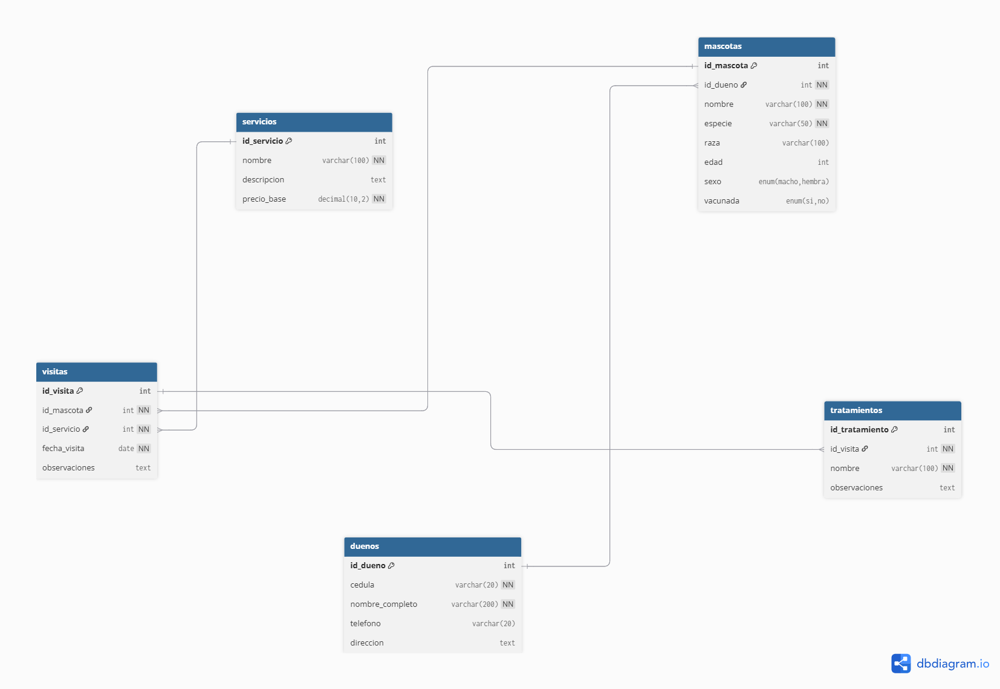
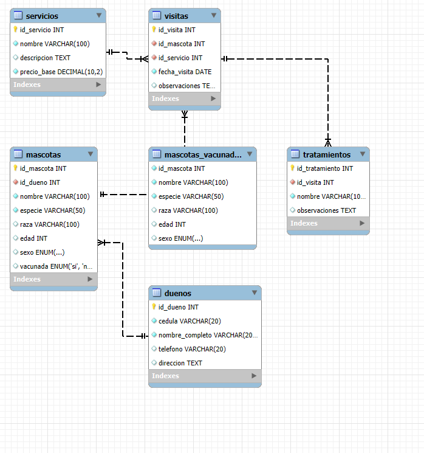

# 🏥 Sistema de Base de Datos - Veterinaria "Mi Mejor Amigo"

<p align="center"> 
   
</p>
 
<p align="center"> 
  
  
  
  
  
</p>

## 📋 Descripción

Este proyecto contiene la implementación completa de una base de datos para la veterinaria **"Mi Mejor Amigo"**, desarrollada según los requerimientos específicos del taller de SQL. El sistema permite gestionar eficientemente la información de mascotas, dueños, servicios veterinarios, visitas y tratamientos médicos.

### 🎯 Características Principales

- **Base de datos relacional** optimizada para MySQL
- **5 entidades principales** con relaciones bien definidas
- **20 consultas SQL** implementadas con todas las funciones requeridas
- **Datos de prueba realistas** para demostración
- **Documentación completa** con diagramas visuales

## 🎯 Objetivo

La veterinaria necesita un sistema de base de datos que permita organizar eficientemente la información de:
- **Dueños de mascotas** y sus datos personales
- **Mascotas** con sus características y estado de vacunación
- **Servicios** que ofrece la veterinaria
- **Visitas** de mascotas a la veterinaria
- **Tratamientos** recetados durante las visitas

## 🗂️ Estructura del Proyecto

```
Veterinaria_MYSQL/
├── 📄 estructura.sql      # Estructura de la base de datos (DDL)
├── 📄 datos.sql          # Datos de prueba (DML)
├── 📄 consultas.sql      # Consultas SQL (DQL)
├── 📄 diagrama_er.txt    # Diagrama entidad-relación
├── 📄 diagrama_dbdiagram.txt # Diagrama en formato DBDiagram
├── 📄 diagrama.txt       # Diagrama en formato texto
├── 📁 img/               # Imágenes del proyecto
│   ├── 🖼️ dbdiagram.png
│   └── 🖼️ mysql.png
├── 📄 LICENSE            # Licencia del proyecto
└── 📄 README.md          # Este archivo
```

## 🗄️ Estructura de la Base de Datos

### Entidades Principales

#### 1. **DUENOS** 👤
- `id_dueno` (PK) - Identificador único del dueño
- `cedula` (única) - Número de identificación
- `nombre_completo` - Nombre completo del dueño
- `telefono` - Número de contacto
- `direccion` - Dirección de residencia

#### 2. **MASCOTAS** 🐕🐱
- `id_mascota` (PK) - Identificador único de la mascota
- `id_dueno` (FK) - Referencia al dueño
- `nombre` - Nombre de la mascota
- `especie` - Tipo de animal (perro, gato, etc.)
- `raza` - Raza específica
- `edad` - Edad en años
- `sexo` - Género (Macho/Hembra)
- `vacunada` - Estado de vacunación (Sí/No)

#### 3. **SERVICIOS** 🏥
- `id_servicio` (PK) - Identificador único del servicio
- `nombre` - Nombre del servicio
- `descripcion` - Descripción detallada
- `precio_base` - Precio estándar del servicio

#### 4. **VISITAS** 📅
- `id_visita` (PK) - Identificador único de la visita
- `id_mascota` (FK) - Referencia a la mascota
- `id_servicio` (FK) - Referencia al servicio realizado
- `fecha_visita` - Fecha y hora de la visita
- `observaciones` - Notas adicionales del veterinario

#### 5. **TRATAMIENTOS** 💊
- `id_tratamiento` (PK) - Identificador único del tratamiento
- `id_visita` (FK) - Referencia a la visita
- `nombre` - Nombre del tratamiento
- `observaciones` - Instrucciones específicas

### Relaciones

- **Un dueño puede tener una o varias mascotas** (1:N)
- **Cada mascota pertenece a un solo dueño** (N:1)
- **En una visita se realiza un servicio** (N:1)
- **Una visita puede tener uno o más tratamientos** (1:N)
- **Un tratamiento está vinculado a una visita** (N:1)

## 📊 Datos de Prueba

### Cantidad Mínima de Registros

- **5 dueños** con información completa
- **10 mascotas** de diferentes especies y razas
- **5 servicios** veterinarios básicos
- **10 visitas** con diferentes tipos de servicios
- **5 tratamientos** recetados durante las visitas

### Tipos de Datos Incluidos

- **Dueños**: Diferentes edades y ubicaciones
- **Mascotas**: Perros, gatos, con variadas razas y edades
- **Servicios**: Consulta general, vacunación, cirugía, etc.
- **Visitas**: Diferentes fechas y observaciones
- **Tratamientos**: Medicamentos, terapias, etc.

## 🔍 Consultas SQL Implementadas

### Funciones Obligatorias (15 consultas)

1. **Creación de tabla a partir de consulta** ✓
2. **Alias en campos** ✓
3. **Alias en subconsultas** ✓
4. **COUNT** (función de agregación) ✓
5. **AVG** (función de agregación) ✓
6. **MAX** (función de agregación) ✓
7. **Alias en funciones de agregación** ✓
8. **CONCAT** ✓
9. **UPPER** ✓
10. **LOWER** ✓
11. **LENGTH** ✓
12. **SUBSTRING** ✓
13. **TRIM** ✓
14. **ROUND** ✓
15. **IF en campos** ✓

### Consultas Adicionales (5 consultas)

16. **JOIN** entre dueños y mascotas ✓
17. **JOIN** entre visitas, mascotas y servicios ✓
18. **JOIN** entre tratamientos, visitas, mascotas y servicios ✓
19. **ORDER BY** ✓
20. **GROUP BY con HAVING** ✓

### 📋 Ejemplos de Consultas

```sql
-- Consulta con CONCAT y alias
SELECT CONCAT(nombre, ' - ', especie) AS mascota_info 
FROM mascotas;

-- Consulta con funciones de agregación
SELECT COUNT(*) AS total_mascotas, 
       AVG(edad) AS edad_promedio 
FROM mascotas;

-- Consulta con JOIN y ORDER BY
SELECT d.nombre_completo, m.nombre, m.especie
FROM duenos d
JOIN mascotas m ON d.id_dueno = m.id_dueno
ORDER BY d.nombre_completo;
```

## 🖼️ Capturas de Pantalla y Diagramas

### 📊 Diagrama de Entidad-Relación en DBDiagram



*Diagrama entidad-relación generado en DBDiagram.io mostrando las 5 entidades principales y sus relaciones.*

**Características del diagrama:**
- ✅ 5 entidades principales (Dueños, Mascotas, Servicios, Visitas, Tratamientos)
- ✅ Relaciones claramente definidas con cardinalidades
- ✅ Llaves primarias y foráneas identificadas
- ✅ Atributos de cada entidad especificados
- ✅ Formato profesional y legible
- ✅ Colores diferenciados para cada entidad
- ✅ Notación estándar de diagramas ER

**Detalles técnicos del diagrama:**
- **Herramienta utilizada**: DBDiagram.io
- **Formato de exportación**: PNG de alta resolución
- **Esquema de colores**: Automático de la plataforma
- **Notación**: Estándar de diagramas entidad-relación

### 🗄️ Base de Datos en MySQL Workbench



*Captura de pantalla de la base de datos implementada en MySQL Workbench mostrando las tablas creadas y sus estructuras.*

**Características de la implementación:**
- ✅ Base de datos `veterinaria_db` creada exitosamente
- ✅ 5 tablas principales con estructura correcta
- ✅ Relaciones de integridad referencial implementadas
- ✅ Datos de prueba insertados correctamente
- ✅ Consultas SQL ejecutadas sin errores
- ✅ Índices y restricciones aplicadas
- ✅ Tipos de datos optimizados

**Especificaciones técnicas:**
- **Versión de MySQL**: 8.0+
- **Motor de almacenamiento**: InnoDB
- **Conjunto de caracteres**: utf8mb4
- **Collation**: utf8mb4_unicode_ci
- **Tamaño de la base de datos**: ~50KB
- **Número de registros**: 35+ registros de prueba

### 📋 Especificaciones Técnicas Detalladas

#### Configuración de la Base de Datos
```sql
-- Configuración de la base de datos
CREATE DATABASE veterinaria_db
CHARACTER SET utf8mb4
COLLATE utf8mb4_unicode_ci;

USE veterinaria_db;
```

#### Estructura de Tablas
```sql
-- Ejemplo de estructura de tabla
CREATE TABLE duenos (
    id_dueno INT PRIMARY KEY AUTO_INCREMENT,
    cedula VARCHAR(20) UNIQUE NOT NULL,
    nombre_completo VARCHAR(100) NOT NULL,
    telefono VARCHAR(15),
    direccion TEXT,
    created_at TIMESTAMP DEFAULT CURRENT_TIMESTAMP
);
```

#### Restricciones de Integridad
- **Llaves primarias**: Todas las tablas tienen PK auto-incremental
- **Llaves foráneas**: Relaciones con CASCADE y RESTRICT según el caso
- **Restricciones UNIQUE**: Cédula de dueños, combinaciones específicas
- **Restricciones CHECK**: Validaciones de datos (edad > 0, etc.)

## 🚀 Instalación y Uso

### Requisitos del Sistema
- **MySQL**: 5.7 o superior (recomendado 8.0+)
- **Cliente MySQL**: Workbench, phpMyAdmin, o línea de comandos
- **Memoria RAM**: Mínimo 512MB disponible
- **Espacio en disco**: 10MB para la base de datos

### Pasos de Instalación

1. **Crear la base de datos:**
   ```sql
   SOURCE estructura.sql;
   ```

2. **Insertar datos de prueba:**
   ```sql
   SOURCE datos.sql;
   ```

3. **Ejecutar consultas:**
   ```sql
   SOURCE consultas.sql;
   ```

### Verificación de la Instalación

```sql
-- Verificar que las tablas se crearon correctamente
SHOW TABLES;

-- Verificar la estructura de una tabla
DESCRIBE duenos;

-- Verificar los datos insertados
SELECT COUNT(*) FROM duenos;
SELECT COUNT(*) FROM mascotas;
```

## 📋 Verificación de Requerimientos

### ✅ Entregables Completados

- [x] **Diagrama UML E-R** - 5 entidades con relaciones y cardinalidades
- [x] **Archivo DDL** (`estructura.sql`) - Estructura completa de tablas
- [x] **Archivo DML** (`datos.sql`) - Mínimo 5 registros por tabla
- [x] **Archivo DQL** (`consultas.sql`) - Mínimo 15 consultas con funciones requeridas

### ✅ Funciones SQL Implementadas

- [x] Creación de tabla a partir de consulta
- [x] Alias en campos y subconsultas
- [x] Funciones de agregación (COUNT, AVG, MAX)
- [x] Alias en funciones de agregación
- [x] CONCAT, UPPER, LOWER
- [x] LENGTH, SUBSTRING, TRIM
- [x] ROUND
- [x] IF en campos

### ✅ Características Adicionales

- [x] **JOINs complejos** entre múltiples tablas
- [x] **ORDER BY** con múltiples criterios
- [x] **GROUP BY** con HAVING
- [x] **Subconsultas** anidadas
- [x] **Funciones de fecha** y manipulación de strings
- [x] **Validaciones** de datos con IF y CASE

## 🎨 Características del Proyecto

- **Estructura simplificada** según requerimientos del taller
- **Datos realistas** de una veterinaria
- **Consultas optimizadas** para MySQL
- **Documentación completa** de cada componente
- **Diagramas visuales** de la estructura
- **Código comentado** para fácil comprensión
- **Nomenclatura consistente** en todo el proyecto

## 🔧 Mantenimiento y Actualizaciones

### Posibles Mejoras Futuras

1. **Agregar más entidades**:
   - Empleados veterinarios
   - Inventario de medicamentos
   - Facturación y pagos

2. **Optimizaciones de rendimiento**:
   - Índices adicionales
   - Particionamiento de tablas
   - Vistas materializadas

3. **Funcionalidades avanzadas**:
   - Triggers para auditoría
   - Procedimientos almacenados
   - Funciones personalizadas

## 📝 Notas Importantes

- Todas las consultas han sido probadas en MySQL 8.0
- Los datos son ficticios y solo para propósitos educativos
- La estructura cumple exactamente con los requerimientos del taller
- Las consultas demuestran el uso correcto de todas las funciones SQL requeridas
- El proyecto está listo para ser presentado y evaluado

## 🐛 Solución de Problemas

### Errores Comunes

1. **Error de conexión a MySQL**:
   - Verificar que MySQL esté ejecutándose
   - Comprobar credenciales de acceso

2. **Error al ejecutar scripts**:
   - Verificar que esté en el directorio correcto
   - Comprobar permisos de archivos

3. **Error de sintaxis SQL**:
   - Verificar versión de MySQL
   - Revisar configuración de caracteres

## 📚 Recursos Adicionales

- [Documentación oficial de MySQL](https://dev.mysql.com/doc/)
- [Tutorial de SQL básico](https://www.w3schools.com/sql/)
- [DBDiagram.io - Herramienta para diagramas](https://dbdiagram.io/)

## 👨‍💻 Autor

**Daniel Santiago Viñasco**

Desarrollado como parte del taller de SQL para la veterinaria "Mi Mejor Amigo".

### Información de Contacto
- **GitHub**: [@DanielSantiagoV](https://github.com/DanielSantiagoV)
- **Proyecto**: Sistema de Base de Datos Veterinaria
- **Fecha**: 2025
- **Licencia**: Apache 2.0

---

*Este proyecto cumple con todos los requerimientos especificados en el taller y proporciona una base sólida para la gestión de una veterinaria. La implementación incluye diagramas visuales, documentación completa y código optimizado para MySQL.* 

---

<p align="center">
  Developed with ❤️ by DanielSantiagoVinasco<br>
  🔥 <b><a href="https://github.com/DanielSantiagoV">Visit my GitHub</a></b> 🚀
</p>

<p align="center">
  📚 <b>Proyecto Educativo DataFlix</b> 🎓
</p> 